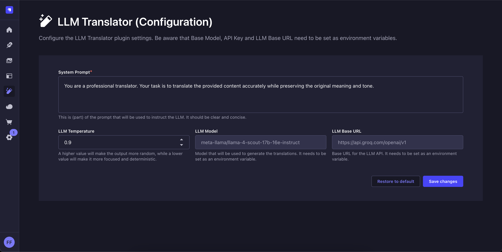

#  Strapi LLM Translator

#### AI-Powered Content Translation for Strapi

The Strapi LLM Translator plugin enhances your localization workflow by utilising LLMs to translate your content fields with a single click. Compatible with any OpenAI-compatible LLM, it preserves your original formatting while delivering fast, accurate results in seconds.

## 🚀 Key Features

- 🌍 **Multi-field Support** - Translates all text-based fields (string, text, richtext) and JSON/Blocks content, including Strapi 5 structured rich text
- 🔌 **LLM Agnostic** - Works with any OpenAI-compatible API (your choice of provider or local)
- 📝 **Format Preservation** - Maintains markdown formatting during translation
- 🔗 **Smart UUID Handling** - Auto-translates slugs when i18n is enabled with relative fields
- ⚡ **Auto-fill** - Instantly populates generated translations
- 🎛️ **Customizable** - Adjust system prompts and temperature for optimal results

---


---

## ✅ Tested With

- **Strapi**: v5.12.x, v5.15.x
- **LLM Providers**:
  - OpenAI: `gpt-4o`
  - Azure OpenAI: `gpt-4.1`
  - Groq: `meta-llama/llama-4-scout-17b-16e-instruct`
  - Local: `Ollama`, e.g. `phi4-mini`

## 🛠️ Installation & Setup

### Prerequisites

- Strapi project (v5+)
- API key for your preferred LLM provider, Base Url + Model Name (+ API Version for Azure OpenAI)
- Configured internationalization with at least two languages in your Strapi application

### Installation

1. Install the plugin in your Strapi project:

```bash
npm install strapi-llm-translator
```

2. Configure environment variables:

```
# Optional - Your LLM provider API key (Can be left empty if there is no API Key needed)
LLM_TRANSLATOR_LLM_API_KEY=

# Optional - Defaults to OpenAI's endpoint
STRAPI_ADMIN_LLM_TRANSLATOR_LLM_BASE_URL=

# Optional - ⚠️ Only Required for Azure OpenAI
STRAPI_ADMIN_LLM_TRANSLATOR_AZURE_API_VERSION=

# Optional - Defaults to gpt-4o
STRAPI_ADMIN_LLM_TRANSLATOR_LLM_MODEL=
```

3. Rebuild your admin panel:

```
npm run build
```

After installation, customize the translation behavior through the LLM Translator configuration page:

---



---

## 💻 Plugin Development

To contribute to the plugin development:

1. Navigate to your Strapi project
2. Add and link the plugin: `npx yalc add strapi-llm-translator && npx yalc link strapi-llm-translator && npm install`
3. Start your Strapi project
4. In a separate terminal, watch the plugin for changes:
   `npm run watch:link`

## About

Franziska Fieke ([grenzbotin](https://github.com/grenzbotin)) – [vulpis.dev](https://vulpis.dev)

Distributed under the MIT license.
See `LICENSE` for more information.
